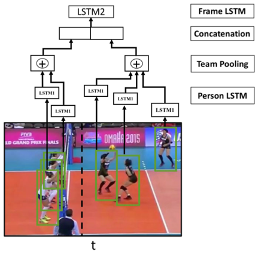
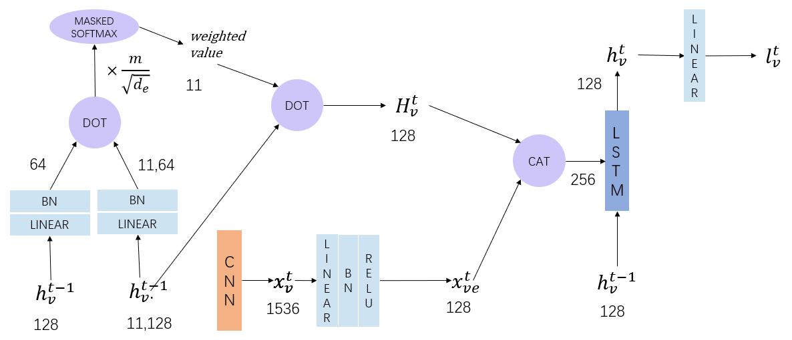

# Baseline 3 - Social Attention Based on Hierarchical Deep Temporal Models

To predict the individual actions and group activities of [Volleyball Dataset](https://github.com/mostafa-saad/deep-activity-rec "Volleyball Dataset"), we need a new backbone architecture since the input becomes RGB information of athletes within their bounding boxes, i.e., $3 \times H \times W$.

Hence, we utilized *Ibrahim et al., A Hierarchical Deep Temporal Model for Group Activity Recognition, CVPR 2016* as a baseline. As the source code is in CAFFE, I implemented the work in PyTorch so that we could try our own ideas on it.

Here I also provide a baseline with the attention mechanism mentioned in **Baseline 2** to improve accuracy. However, this version led to serious overfitting.

## Files Illustration

- [backbone.py](backbone.py "backbone.py") provides the VGG model. The code is from TorchVision.
- [compute_mean.py](compute_mean.py "compute_mean.py") is used to compute the means and standard deviations of $R, G, B$ channels seperately so that we can perform normalization on the input pixels globally.
- [models.py](models.py "models.py") provides the network architecture besides CNN backbone.
- [train_phase1.py](train_phase1.py "train_phase1.py") is used to train the person LSTM and CNN in the first phase. As the number of athletes in each frame varies, the batch size is fixed to $1$.
- [train_phase1_batch.py](train_phase1_batch.py "train_phase1_batch.py") is used to train the person LSTM and CNN in the first phase. The file pads the number of athletes to $12$ by repeating the last $N$ player pixels so that a larger batch size can be utilized.
- [train_phase2.py](train_phase2.py "train_phase2.py") aims to train the person LSTM and group LSTM in the second phase. And the input of this phase if the athlete feature extracted by CNN trained in phase 1.
- [dataloader_phase1.py](dataloader_phase1.py "dataloader_phase1.py") is used to read images from TSV files in the first phase.
- [dataloader_phase2.py](dataloader_phase2.py "dataloader_phase2.py") is used to read features from TSV files in the second phase.

## Methods

### Hierarchical Deep Temporal Models

Let's look at Dr. Ibrahim's architecture first. In his work, the feature of every athlete is extracted by CNN (i.e., AlexNet in his work) and is then fed to Person LSTM. And the output hidden states of Person LSTM are used to predict each athlete's action.

The hidden states of the players are then aggregated if these players are in a team. Next, the aggregated features of the two teams are further combined and fed to Group LSTM. And the output hidden states of Group LSTM are used to predict the group's activity.

As the GPU memory is limited, Dr. Ibrahim used  training phases as followed.

1. train AlexNet & person LSTM
2. generate group LSTM input
3. train group LSTM

### Attention Mechanism

After implementing Dr. Ibrahim's work, we tried to add the attention mechanism described in **Baseline 2** and replaced the AlexNet backbone with Inception-ResNet-v3. We tried several architectures, and one of them is illustrated as followed.

In the above graph, $h_v^t$ is the hidden states of the current object at current frame while $h_v.^t$ is the hidden states aggregation of the nearby objects at current frame. And $m$ denotes the number of nearby objects, $d_e$ is the embedding dimension after the fully connected layer. $\frac{m}{\sqrt{d_e}}$ acts as a normalization term.

After the attention mechanism, we concatenated the result with the embedded $X_v^t$ (i.e., the CNN output) feature, and then fed them to RNN.

The figures in the graph represent feature dimension.
