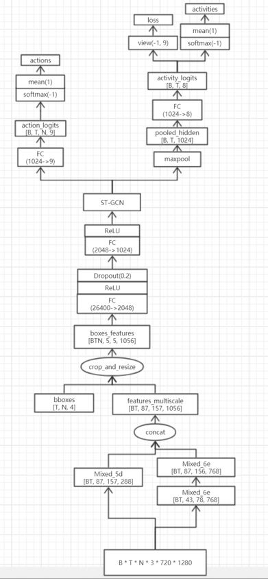
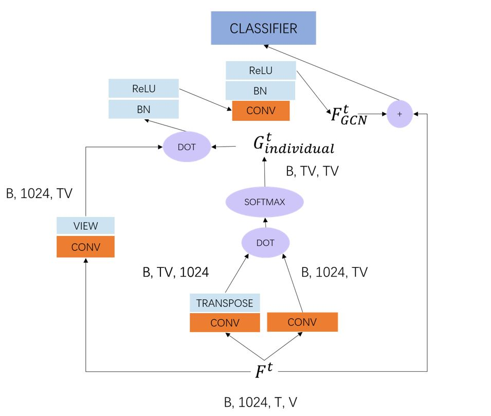
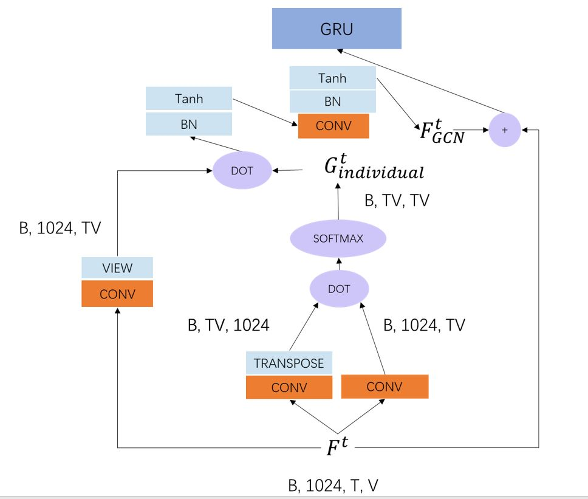

# Baseline 5 - Spatial-Temporal Graph Convolutional Networks Based on SSU

After implementing **Baseline 5** and adding attention mechanism, the test accuracy remained to be below the state of the art. Hence, we replaced the attention mechanism with *Yan et al., Spatial-Temporal Graph Convolutional Network, AAAI 2019* and got the best result at that time.

## Files Illustration

- data
  - [write_bboxes.py](data/write_bboxes.py "write_bboxes.py") aims to write bounding boxes to TSV file.
- models
  - [classifiers.py](models/classifiers.py "classifiers.py") provides linear classifiers in first and second training phase.
  - [inception.py](models/inception.py "inception.py") provides backbone CNN architecture. The code is writtent by TorchVision.
  - [model_b_gcn.py](models/model_b_gcn.py "model_b_gcn.py") is a proposed architecture implementing the GCN module.
  - [model_b_gcn_gru.py](models/model_b_gcn_gru.py "model_b_gcn_gru.py") is a proposed architecture with a GRU cell following the GCN module.
  - [model_b_multihead.py](models/model_b_multihead.py "model_b_multihead.py") is a proposed architecture implementing multihead GCN module.
- [io_common.py](io_common.py "io_common.py") & [tsv_io.py](tsv_io.py "tsv_io.py") provide the tools to read TSV files. The two files are written by Microsoft Research.
- [train_a.py](train_a.py "train_a.py") provides the main function to train network in the first phase.
- [feature_extractor.py](feature_extractor.py "feature_extractor.py") is used to extract feature from RGB images using the CNN trained in the first phase.
- [train_b.py](train_b.py "train_b.py") provides the main function to train network in the second phase.
- [image_loader_a.py](image_loader_a.py "image_loader_a.py") is used to read images from TSV files for the first training phase.
- [feature_loader_b.py](feature_loader_b.py "feature_loader_b.py") is used to read extracted features from TSV files for the second training phase.

## Methods

The backbone network in this baseline is the same as **Baseline 4**. Hence, the following explaination mainly concentrates on the GCN architecture. Furthermore, as the first training phase is the same as **Baseline 4**, the following figures are for the second trainning phase.

### GCN

The overall architecture of this version is as followed:

And one of the tested GCN module details are shown here:

In the above graph, $B, T, V$ represents the batch size, the time frame and the number of athletes.

The left convolutional layer is used to operate spatial convolution. And the middle convolutional layers are used to calculate attention masks. The upper convolutional layer is used to perform temporal convolution.

The ST-GCN result is then fed to classifier directly.

### GCN with GRU

The overall architecture of this version is as followed:

And one of the tested GCN module details are shown here:

In the above graph, $B, T, V$ represents the batch size, the time frame and the number of athletes.

The left convolutional layer is used to operate spatial convolution. And the middle convolutional layers are used to calculate attention masks. The upper convolutional layer is used to perform temporal convolution.

After ST-GCN, a skip connection is used to keep the information from the original feature. And the added feature is finallt fed to GRU.

## Results

Part of the result statics is shown as below:

| Version | Architecture | Group Act. Rec. Acc. |
| ---------- | :-----------:  | :-----------: |
| original | 26400 -> 2048   2048 -> 1024   GRU | 91.32% |
| B x TV xTV | 26400 -> 2048   2048 -> 1024   ST-GCN (B x TV xTV) | 91.25% |
| BT x V x V | 26400 -> 2048   2048 -> 1024   ST-GCN (BT x V x V) | 90.58% |
| B x TV xTV GRU | 26400 -> 2048   2048 -> 1024   ST-GCN (B x TV xTV)   GRU | 91.70% |

The architecture column demonstrates the feature dimention changing through the architecture. And the third row aims to constraint the model to model the relationship between players focusing only the current frame.
