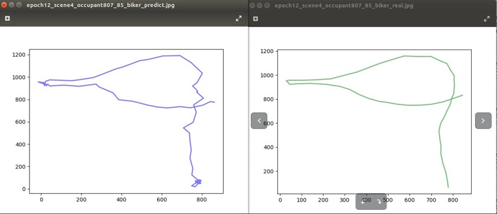
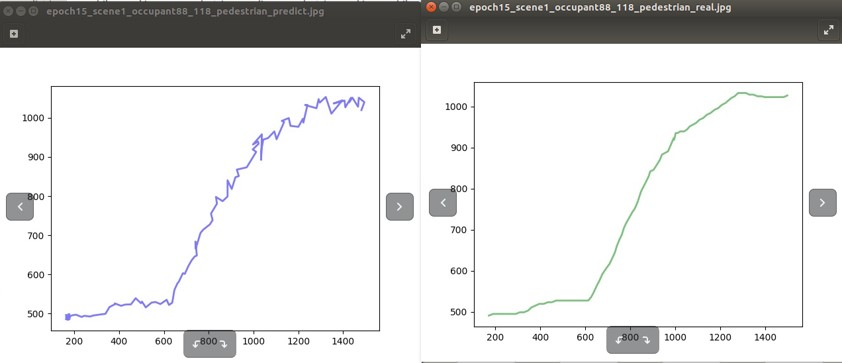
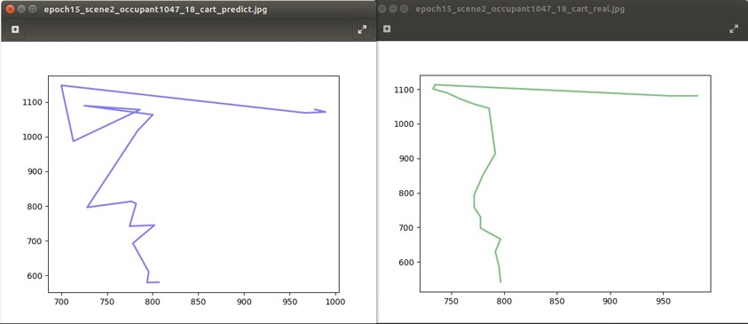
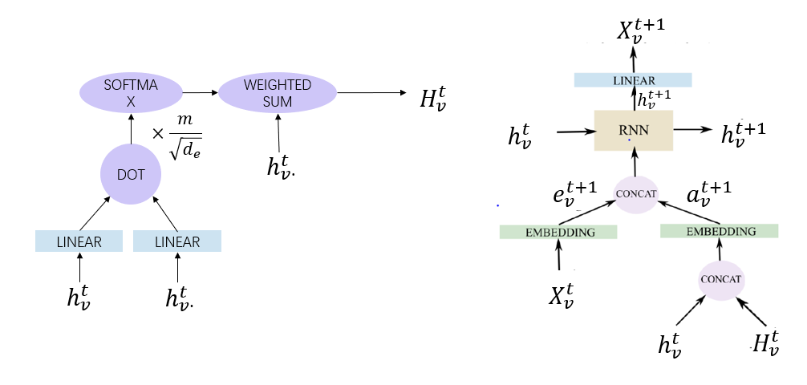
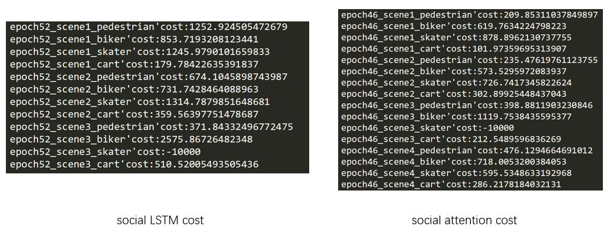

# Baseline 1 & 2

  - [Files Illustration](#files-illustration)
  - [Baseline 1 - Social LSTM](#baseline-1---social-lstm)
    - [Methods](#methods)
    - [Results](#results)
      - [Biker](#biker)
      - [Pedestrian](#pedestrian)
      - [Cart](#cart)
      - [Skater](#skater)
  - [Baseline 2 - Social Attention](#baseline-2---social-attention)
    - [Methods](#methods-1)
    - [Result](#result)

This page provides the source code for the first two baselines. To be more specific, [train.py](train.py "train.py") is the main function for the first baseline and [train_atten.py](train_atten.py "train_atten.py") is for the other.

The baselines were developed using `python 2.7` and `PyTorch 0.4.0`.

## Files Illustration

- [models.py](models.py "models.py") provides the basic model and attention model for the two baselines.
- [train_dataset.py](train_dataset.py "train_dataset.py") is used to read data from files.
- [visual.py](visual.py "visual.py") provides the visualization tool for the two baselines using Matplotlib.

## Baseline 1 - Social LSTM

This baseline aims to implement *Alahi et al., Social LSTM: Human Trajectory Prediction in Crowded Spaces, CVPR 2016* on [Stanford Drone Dataset](http://cvgl.stanford.edu/projects/uav_data/ "Stanford Drone Dataset")
using PyTorch. The baseline aims to predict pedestrian’s track with the help of Social Pooling Algorithm and LSTM (we replaced it with GRU)

Please note that a PyTorch version was not available then. Hence, I referred to a [Theano version](https://github.com/karthik4444/nn-trajectory-prediction "Social LSTM")

### Methods

Each pedestrian in the scene is assigned an RNN. And the hidden state of a pedestrian corresponds to the trajectory of a pedestrian’s path thus far.

At each time step, a pooling layer gathers neighboring trajectories. If there are two or more people in the same grid, then their hidden states are pooled. Then, I embed this into a vector and feed it into the RNN.

### Results

Some of the visualization graphs are shown here. (left: prediction, right: ground truth)

#### Biker

#### Pedestrian

#### Cart

#### Skater

## Baseline 2 - Social Attention

However, the interactions between athletes can be more complex than a function of proximity. For example, pedestrian may focus on a farther fast-moving cart more than a nearby slow-moving pedestrian. Hence, it helps if the model can focus on all of the objects in a frame and giving each objects an attention weight.

So I added the attention mechanism described by *Vemula et al., Social Attention: Modeling Attention in Human Crowds, ICRA 2018* to help the model focus on all other objects in the frame when predicting the current object's track.

### Methods

In the above graph, $h_v^t$ is the hidden states of the current object at current frame while $h_v.^t$ is the hidden states aggregation of the nearby objects at current frame. And $m$ denotes the number of nearby objects, $d_e$ is the embedding dimension after the fully connected layer. $\frac{m}{\sqrt{d_e}}$ acts as a normalization term.

After the attention mechanism, we concatenated the result with the embedded $X_v^t$ (i.e., the $x, y$ coordinates of the object) feature, and then fed them to RNN.

### Result

Here the test error comparison of the two baselines is given. We can clearly figure out that the attention mechanism decreased the test error.

